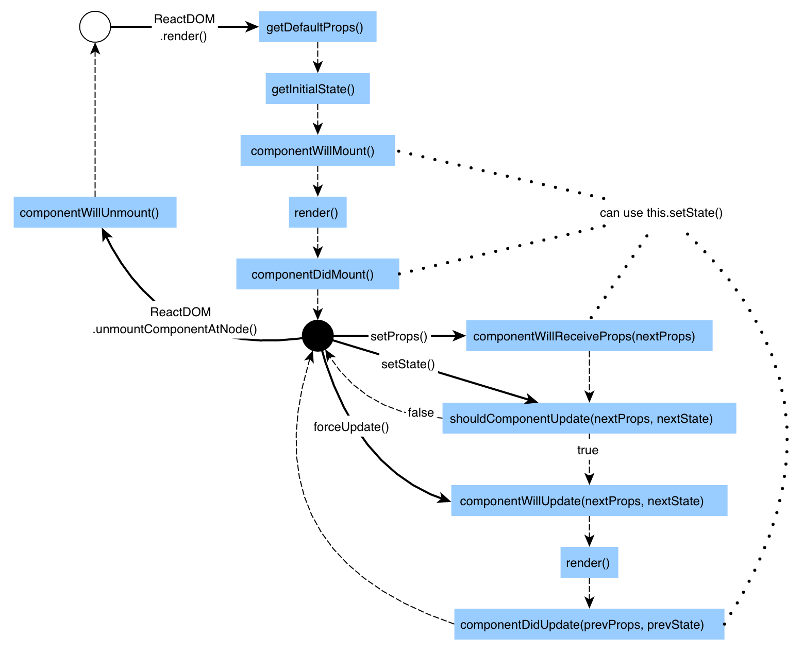

### React Class vs Function Style
---
Class - React 기능 Full 사용 가능 / class 문법 알아야하고 장황

Function - 함수 문법만 알면 사용 가능 / 기능 부족 (대표적 - State, Life Cycle API 사용 불가)

Hook 도입 -> Function에서도 State, Life Cycle API 사용 가능 (Class와 대등해짐)

####1. 개발 환경 구축
```bash
$ npx create-react-app .
```
- src 폴더 내 App.css, index.css 정리
- App.js 정리 및 코딩

####2. Component 생성
- Function Style Component ( `return()` )
```javascript
function FuncComp(){
  return (
    <div className="container">
      <h2>function style component</h2>
    </div>
  )
}
```
- Class Style Component ( `extends` `render()` `return()` )
```javascript
class ClassComp extends React.Component{
  render(){
    return(
      <div className="container">
        <h2>class style component</h2>
      </div>
    )
  }
}
```
####3. props 전달 방식
- Function Style Component ( **인자로 전달** )
```javascript
function FuncComp(props){
  return (
    <div className="container">
      <h2>function style component</h2>
      <p>Number : {props.initNumber}</p>
    </div>
  )
}
```
- Class Style Component ( **this로 전달** )
```javascript
class ClassComp extends React.Component{
  render(){
    return(
      <div className="container">
        <h2>class style component</h2>
        <p>Number : {this.props.initNumber}</p>
      </div>
    )
  }
}
```
####3-1. Class에서 State 사용법
▼ 위 코드를 **State로 변환** ▼
```javascript
class ClassComp extends React.Component{
  state = {
    number: this.props.initNumber
  }
  render(){
    return(
      <div className="container">
        <h2>class style component</h2>
        <p>Number : {this.state.number}</p>
      </div>
    )
  }
}
```
▼ State의 **값을 변경** ( `.bind(this)` 사용, **Function 방식**은 변경 불가 > **Hook**으로 가능 )
```javascript
class ClassComp extends React.Component{
  state = {
    number: this.props.initNumber
  }
  render(){
    return(
      <div className="container">
        <h2>class style component</h2>
        <p>Number : {this.state.number}</p>
        <input type="button" value="random" onClick={
          function(){
            this.setState({number:Math.random()})
          }.bind(this)
        }></input>
      </div>
    )
  }
}
```
####3-2. 함수에서의 State 사용 = Hook 도입
▼ Function Style 내 Hook `.useState`  으로 State 사용
```javascript
import React, {useState} from 'react';
```
```javascript
function FuncComp(props){
  const numberState = useState(props.initNumber);
  const number = numberState[0];
  const setNumber = numberState[1];
  return (
    <div className="container">
      <h2>function style component</h2>
      <p>Number : {number}</p>
      <input type="button" value="random" onClick={
          function(){
            setNumber(Math.random());
          }
        }></input>
    </div>
  )
}
```
▼ **Function Style**
```javascript
function FuncComp(props){
  const numberState = useState(props.initNumber);
  const number = numberState[0];
  const setNumber = numberState[1];

  // const dateState = useState((new Date()).toString());
  // const _date = dateState[0];
  // const setDate = dateState[1];
  // ===
  const [_date, setDate] = useState((new Date()).toString());

  return (
    <div className="container">
      <h2>function style component</h2>
      <p>Number : {number}</p>
      <p>Date : {_date}</p>
      <input type="button" value="random" onClick={
          function(){
            setNumber(Math.random());
          }
        }></input>
        <input type="button" value="date" onClick={
          function(){
            setDate((new Date()).toString());
          }
        }></input>
    </div>
  )
}
```
▼ **Class Style**
```javascript
class ClassComp extends React.Component{
  state = {
    number: this.props.initNumber,
    date:(new Date()).toString()
  }
  render(){
    return(
      <div className="container">
        <h2>class style component</h2>
        <p>Number : {this.state.number}</p>
        <p>Deate : {this.state.date}</p>
        <input type="button" value="random" onClick={
          function(){
            this.setState({number:Math.random()})
          }.bind(this)
        }></input>
        <input type="button" value="date" onClick={
          function(){
            this.setState({date:(new Date()).toString()})
          }.bind(this)
        }></input>
      </div>
    )
  }
}
```
####4-1. Class Style에서의 LifeCycle
1. **React Life Cycle**



2. **Class Style Life Cycle**

    `componentWillMount` ▻ `render` ▻ `componentDidMount` ▻ rendering 완료

    상태변화 ▻ `shouldComponentUpdate` ▻ `componentWillUpdate` ▻ `render` ▻ `componentDidUpdate`

####4-2. Function Style에서의 LifeCycle
1. **Function Style Life Cycle**

    `render` ▻ `useEffect` ▻ 상태변화 ▻ `render` ▻ `useEffect return (Cleanup)` ▻ `useEffect`
<br>
2. **useEffect** 

    Class Style의 `componentDidMount` & `componentDidUpdate` 와 같은 역할, 

    여러개의 useEffect 함수 동시 실행 가능
<br>
3. **Clean up** ( 정리작업이 필요할 때 사용 )
```javascript
useEffect(function(){
  return function cleanup(){

  }
});
```  
4. **skippingEffect** ( 변화된 값에 대한 처리만 실행해 성능 향상 )
```javascript
useEffect(function(){
  return function cleanup(){

  }
}, []);
```